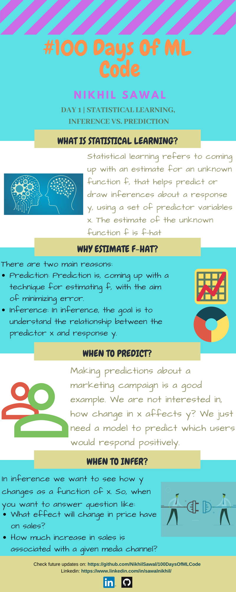
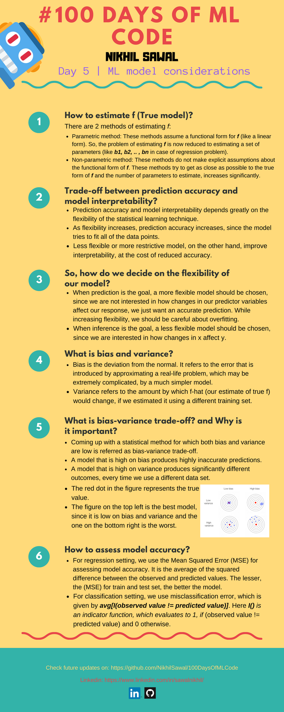
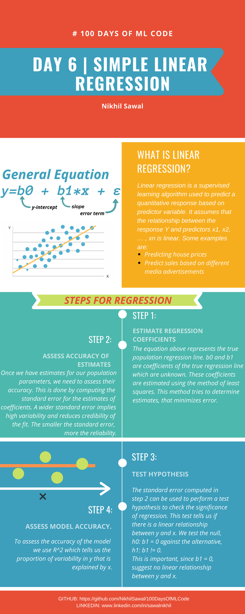
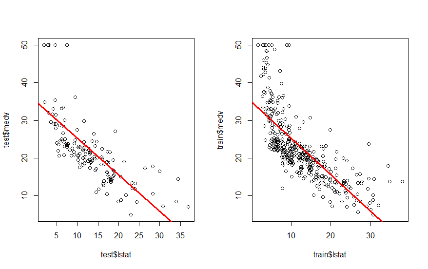
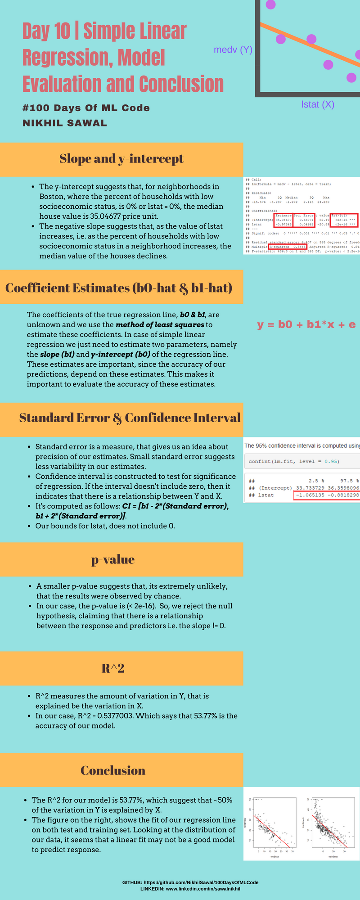

# 100DaysOfMLCode

## Day 1 | Statistical Learning, Inference vs. Prediction  
Being the first day of the challenge, I decided to get used to the github environment and start with a little introduction to Machine 
Learning. The following infographic is a more simplified version of the [mathematical document](https://github.com/NikhilSawal/100DaysOfMLCode/blob/master/day%201/day%201.docx).  

So, why did I start with Statistical Learning?  
Because machine learning uses statistical techniques to give computers the ability to `learn` using data.  

  

## Day 2 | [R Data types and Data structure (Vectors)](https://github.com/NikhilSawal/100DaysOfMLCode/tree/master/Data%20types%20and%20data%20structures%20in%20r)  

On day 2, I have covered the basic data types and the data structure, vector (one dimensional arrays in other programming languages) in R.
Exploring and understanding the basics is really important, before we move to the more advanced machine learning applications. Plus it would be a good reference. 

## Day 3 | [Data structure (Matrix)](https://github.com/NikhilSawal/100DaysOfMLCode/tree/master/Data%20types%20and%20data%20structures%20in%20r)

Today I added operations related to matrices, in the r_datatypes_datastructures file. The readme.rmd file is also updated with the same. Following along today's updates, you should get familier with:  

* Creating a matrix in r
* Arithmetic functions for matrices, and
* Matrix indexing operations  

## Day 4 | [Data structure (Dataframes)](https://github.com/NikhilSawal/100DaysOfMLCode/tree/master/Data%20types%20and%20data%20structures%20in%20r)

For day 4, I added the syntax for data frames, which is what we would be dealing with, 80% of the times in any machine learning project. I have added all the changes to r_datatypes_datastructures.r and readme.rmd file. The syntax documented in today's post should get you acquainted with: 

* Accessing built-in data frames in R
* Creating data frames
* Indexing and sorting rows as per conditions
* Referencing [Cells, Columns, Rows]
* Filtering data, and
* Dealing with NA's  

All of the above mentioned operations are important from Exploratory data analysis stand point. 

## Day 5 | ML model considerations  
  
On Day 1, we saw what is statistical learning, what is the difference between inference and prediction and we also understood why to estimate f-hat. Today I decided to continue that topic further and answer:  
* How to estimate *f* ?
* How is flexibility related to prediction accuracy and model interpretability?
* What is bias-variance trade-off?
* How to assess model accuracy?  

 

## Day 6 | Simple Linear Regression 

Today's infographics explains the mathematical intuition behind simple linear regression.  

 

## Day 7 | [Simple Linear Regression (r code)](https://github.com/NikhilSawal/100DaysOfMLCode/tree/master/simple_linear_regression)  

Performed simple linear regression on boston dataset from `ISLR package` in r, taking medv(median house value) as the response and lstat (percent of households with low socioeconomic status) as predictor. The r file covers all steps layed out in day 6 infographics including:  
* Estimating regression coefficients.  
* Assessing accuracy of the coefficients by computing standard error.  
* Testing significance of regression.  
* Computing R^2 for checking the accuracy of the fit.  

## Day 8 | [Simple Linear Regression (Contd.)](https://github.com/NikhilSawal/100DaysOfMLCode/tree/master/simple_linear_regression)  

Today I continued on the Day 7 problem and performed the following tasks:  
* Test-train split, using `caTools` package in R
* Created a function `make_zero` that replaces every negative values from the prediction vector, with 0
* Computed MSE and R^2 for the prediction generated from the test set
* Plotted the regression line on both test and train set  

## Day 9 | [Simple Linear Regression (Intepretation of the model outcome)](https://github.com/NikhilSawal/100DaysOfMLCode/blob/master/simple_linear_regression/simple_linear_regression.rmd)  

Today I updated the readme file for the simple linear regression implementation on Day 7 and Day 8. Todays updates are math and stat intensive and I have made attempts to provide an easy description for interpreting different outcomes like:  
* Slope and y-intercept
* Standard error of the estimates of regression coefficients
* Confidence interval and p-values
* Measures of assessing model accuracy  

  

## Day 10 | Simple Linear Regression [Model Evaluation and conclusion]

Today's infographics evaluate the simple linear regression model we developed from Day 6 - Day 9 and makes conclusions.  

 
