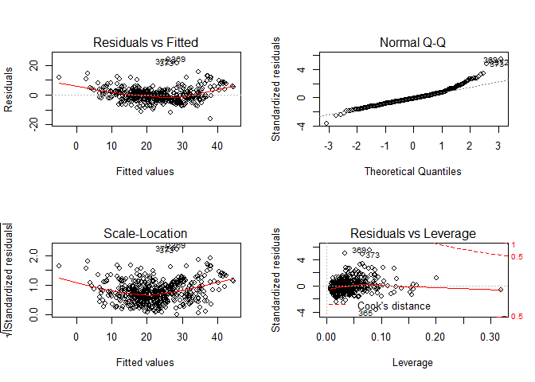

Multiple Linear Regression
================
Nikhil Sawal
August 21, 2018

Loading libraries
-----------------

``` r
library(MASS)
library(ISLR)
```

    ## Warning: package 'ISLR' was built under R version 3.5.1

``` r
library(caTools)
```

    ## Warning: package 'caTools' was built under R version 3.5.1

``` r
library(corrplot)
```

    ## Warning: package 'corrplot' was built under R version 3.5.1

    ## corrplot 0.84 loaded

``` r
df <- Boston
attach(df)
```

Test-train split
----------------

``` r
set.seed(102)
split <- sample.split(df$medv, SplitRatio = 0.7)
train <- subset(df, split == T)
test <- subset(df, split == F)
```

Model 1 \[With all predictors\]
-------------------------------

``` r
lm.fit <- lm(medv~., data = train)
summary(lm.fit)
```

    ## 
    ## Call:
    ## lm(formula = medv ~ ., data = train)
    ## 
    ## Residuals:
    ##      Min       1Q   Median       3Q      Max 
    ## -16.0023  -2.5950  -0.4634   2.0627  27.2807 
    ## 
    ## Coefficients:
    ##               Estimate Std. Error t value Pr(>|t|)    
    ## (Intercept)  30.518071   5.877156   5.193 3.51e-07 ***
    ## crim         -0.021169   0.059891  -0.353 0.723960    
    ## zn            0.045997   0.015667   2.936 0.003543 ** 
    ## indus         0.032044   0.069609   0.460 0.645553    
    ## chas          1.910784   1.011363   1.889 0.059669 .  
    ## nox         -18.370764   4.491537  -4.090 5.35e-05 ***
    ## rm            4.473386   0.481915   9.283  < 2e-16 ***
    ## age           0.003602   0.015286   0.236 0.813839    
    ## dis          -1.482459   0.233574  -6.347 6.75e-10 ***
    ## rad           0.258453   0.078086   3.310 0.001030 ** 
    ## tax          -0.012798   0.004257  -3.007 0.002831 ** 
    ## ptratio      -0.863687   0.150515  -5.738 2.06e-08 ***
    ## black         0.011104   0.003118   3.562 0.000419 ***
    ## lstat        -0.522442   0.060765  -8.598 2.68e-16 ***
    ## ---
    ## Signif. codes:  0 '***' 0.001 '**' 0.01 '*' 0.05 '.' 0.1 ' ' 1
    ## 
    ## Residual standard error: 4.68 on 353 degrees of freedom
    ## Multiple R-squared:  0.7649, Adjusted R-squared:  0.7563 
    ## F-statistic: 88.36 on 13 and 353 DF,  p-value: < 2.2e-16

Model 2 \[With only significant predictors\]
--------------------------------------------

``` r
lm.fit1 <- lm(medv~.-crim-indus-age, data = train)
summary(lm.fit1)
```

    ## 
    ## Call:
    ## lm(formula = medv ~ . - crim - indus - age, data = train)
    ## 
    ## Residuals:
    ##      Min       1Q   Median       3Q      Max 
    ## -16.0325  -2.5719  -0.4566   2.0791  27.5287 
    ## 
    ## Coefficients:
    ##               Estimate Std. Error t value Pr(>|t|)    
    ## (Intercept)  29.868763   5.738718   5.205 3.29e-07 ***
    ## zn            0.044016   0.015287   2.879 0.004226 ** 
    ## chas          1.995515   0.998454   1.999 0.046411 *  
    ## nox         -17.397150   4.138890  -4.203 3.33e-05 ***
    ## rm            4.496211   0.464739   9.675  < 2e-16 ***
    ## dis          -1.503918   0.215886  -6.966 1.58e-11 ***
    ## rad           0.236889   0.069058   3.430 0.000674 ***
    ## tax          -0.011843   0.003815  -3.105 0.002058 ** 
    ## ptratio      -0.847276   0.147582  -5.741 2.02e-08 ***
    ## black         0.011309   0.003035   3.726 0.000226 ***
    ## lstat        -0.519031   0.056545  -9.179  < 2e-16 ***
    ## ---
    ## Signif. codes:  0 '***' 0.001 '**' 0.01 '*' 0.05 '.' 0.1 ' ' 1
    ## 
    ## Residual standard error: 4.663 on 356 degrees of freedom
    ## Multiple R-squared:  0.7647, Adjusted R-squared:  0.758 
    ## F-statistic: 115.7 on 10 and 356 DF,  p-value: < 2.2e-16

Model Evaluation Function, `model_eval`
---------------------------------------

This function is written for reusability. Notice that every time we fit a new model, we would need to repeat the following operations over and over again.

-   Make predictions & store them in a data frame with the observed values
-   Replace negatives by zeros, if any in the predictions
-   Coompute MSE and R^2

Wrapping these operations in a function, will save us a lot of time, since all we need to do is call the function, `model_eval` and pass in the new model we fit and it will return the test MSE and R^2 in the form of a list.

``` r
model_eval <- function(model){
  
  # Prediction
  predictions <- predict(model, test)
  results <- cbind(predictions, test$medv)
  colnames(results) <- c('Predictions', 'Observed')
  results <- as.data.frame(results)
  
  # Function to replace negatives with 0
  make_zero <- function(x){
    if(x<0){
      return(0)
    }else{
      return(x)
    }
  }
  
  results$Predictions <- sapply(results$Predictions, make_zero)
  
  # Mean squared error
  mse <- mean((results$Predictions - results$Observed)^2)

  # R^2
  SSRes <- sum((results$Predictions-results$Observed)^2)
  SST <- sum((results$Observed-mean(results$Observed))^2)
  
  r2 <- 1 - (SSRes/SST) 
  return(list(mse, r2))
  
}
```

Interaction terms
-----------------

The previous two models made a serious assumption, that the relationship between response `Y` and predictor `X` is additive, i.e. the effect of changes in a predictor variable `Xj` on the response `Y`, is independent of the values of other predictors. We relax this assumption by including the interaction terms.

**How do we choose the interaction terms?**

We check the correlation between the predictor variables and select the variables that have a correlation &gt; 0.7 We use the `corrplot()` library in R to visualize the correlations. Once we identify a set of variables that are highly correlated, we include their interaction terms in our model and refit. The following lines of code and plot will help us visualize.

``` r
M <- cor(df)
corrplot(M, method = "circle")
```


From the above plot, we observe strong intractions like `indus*nox, indus*dis, indus*tax, nox*age, noc*dis, ade*dis, rad*tax`. We refit the model using the main effects and interaction and check the summary.

``` r
lm.fit2 <- lm(medv ~ crim + zn + chas + rm + ptratio + black + lstat +
                indus*nox + indus*dis + indus*tax + nox*age + nox*dis + 
                age*dis + rad*tax)
summary(lm.fit2)
```

    ## 
    ## Call:
    ## lm(formula = medv ~ crim + zn + chas + rm + ptratio + black + 
    ##     lstat + indus * nox + indus * dis + indus * tax + nox * age + 
    ##     nox * dis + age * dis + rad * tax)
    ## 
    ## Residuals:
    ##      Min       1Q   Median       3Q      Max 
    ## -16.0671  -2.6517  -0.4981   2.0096  24.0760 
    ## 
    ## Coefficients:
    ##               Estimate Std. Error t value Pr(>|t|)    
    ## (Intercept) 23.9480482 12.0442307   1.988 0.047336 *  
    ## crim        -0.1473236  0.0333201  -4.421 1.21e-05 ***
    ## zn           0.0100332  0.0164579   0.610 0.542395    
    ## chas         2.6240660  0.8455022   3.104 0.002024 ** 
    ## rm           3.7814191  0.4114869   9.190  < 2e-16 ***
    ## ptratio     -1.0333229  0.1363129  -7.581 1.76e-13 ***
    ## black        0.0091945  0.0026257   3.502 0.000505 ***
    ## lstat       -0.5190776  0.0499403 -10.394  < 2e-16 ***
    ## indus        0.6725452  0.5133289   1.310 0.190760    
    ## nox         12.4014775 21.5923701   0.574 0.566000    
    ## dis          1.0725845  1.3932485   0.770 0.441767    
    ## tax         -0.0274312  0.0063078  -4.349 1.67e-05 ***
    ## age          0.0983326  0.1335702   0.736 0.461973    
    ## rad          0.6932244  0.2827978   2.451 0.014586 *  
    ## indus:nox   -0.8964992  0.7830066  -1.145 0.252797    
    ## indus:dis   -0.1552493  0.0478975  -3.241 0.001272 ** 
    ## indus:tax    0.0008282  0.0003106   2.667 0.007920 ** 
    ## nox:age     -0.1855218  0.2172124  -0.854 0.393470    
    ## nox:dis     -2.8024532  3.2633266  -0.859 0.390891    
    ## dis:age     -0.0052954  0.0085411  -0.620 0.535557    
    ## tax:rad     -0.0004907  0.0004255  -1.153 0.249375    
    ## ---
    ## Signif. codes:  0 '***' 0.001 '**' 0.01 '*' 0.05 '.' 0.1 ' ' 1
    ## 
    ## Residual standard error: 4.6 on 485 degrees of freedom
    ## Multiple R-squared:  0.7597, Adjusted R-squared:  0.7498 
    ## F-statistic: 76.67 on 20 and 485 DF,  p-value: < 2.2e-16

There is very little difference between the the R^2 value of this model and the previous model. Let \#\# MSE and R2 \#\#\# Model 0

``` r
model_eval(lm.fit)
```

    ## [[1]]
    ## [1] 25.70435
    ## 
    ## [[2]]
    ## [1] 0.626477

### Model 1

``` r
model_eval(lm.fit1)
```

    ## [[1]]
    ## [1] 26.40253
    ## 
    ## [[2]]
    ## [1] 0.6163315

### Model 2

``` r
model_eval(lm.fit2)
```

    ## [[1]]
    ## [1] 21.17966
    ## 
    ## [[2]]
    ## [1] 0.6922277

Model 2 has shown good improvement in the test MSE and R^2 value. The MSE has reduced a little but the test R^2 has shown ~8% improvement.

Model adequacy checks
=====================

Model 2
-------

To check the adequacy of the model, we will plot residuals vs. fitted values, to see if our assumptions about, linear relationship betweeen Y & X and constant variance of error terms hold.

``` r
par(mfrow=c(2,2))
plot(lm.fit2)
```


