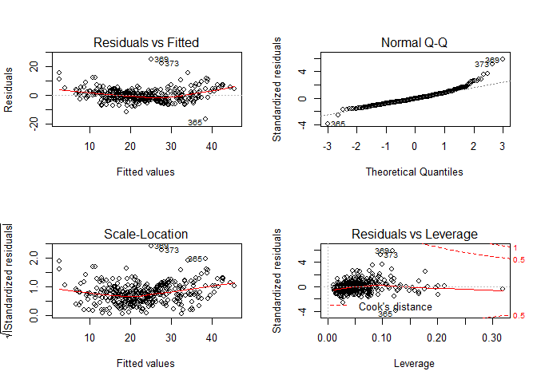

Multiple Linear Regression
================
Nikhil Sawal
August 21, 2018

Loading libraries
-----------------

``` r
library(MASS)
library(ISLR)
library(caTools)
library(corrplot)
library(car)

df <- Boston
attach(df)
```

Test-train split - using `caTools` package
------------------------------------------

``` r
set.seed(102)
split <- sample.split(df$medv, SplitRatio = 0.7)
train <- subset(df, split == T)
test <- subset(df, split == F)
```

Model 1 \[With all predictors\]
-------------------------------

Our first model of choice should be to include all variables and see how the model performs. Following lines of code will help us fit a model and dislplay the summary using the `summary()` function. The summary include estimates for our model coefficients i.e. all the `beta-hat's`, the standard error and the p-value based on t-statistic. It also outputs, values of the training R^2 and (adjusted R^2). We haven't talked about adjusted R^2 yet, but it's another and more reliable measure for checking model accuracy. The reason it is more reliable is that, unlike R^2, (adjusted R^2) penalizes if noise variables are added to the model, whereas R^2 keeps increasing as we add more variables to our model.

``` r
lm.fit <- lm(medv~., data = train)
summary(lm.fit)
```

    ## 
    ## Call:
    ## lm(formula = medv ~ ., data = train)
    ## 
    ## Residuals:
    ##      Min       1Q   Median       3Q      Max 
    ## -16.0023  -2.5950  -0.4634   2.0627  27.2807 
    ## 
    ## Coefficients:
    ##               Estimate Std. Error t value Pr(>|t|)    
    ## (Intercept)  30.518071   5.877156   5.193 3.51e-07 ***
    ## crim         -0.021169   0.059891  -0.353 0.723960    
    ## zn            0.045997   0.015667   2.936 0.003543 ** 
    ## indus         0.032044   0.069609   0.460 0.645553    
    ## chas          1.910784   1.011363   1.889 0.059669 .  
    ## nox         -18.370764   4.491537  -4.090 5.35e-05 ***
    ## rm            4.473386   0.481915   9.283  < 2e-16 ***
    ## age           0.003602   0.015286   0.236 0.813839    
    ## dis          -1.482459   0.233574  -6.347 6.75e-10 ***
    ## rad           0.258453   0.078086   3.310 0.001030 ** 
    ## tax          -0.012798   0.004257  -3.007 0.002831 ** 
    ## ptratio      -0.863687   0.150515  -5.738 2.06e-08 ***
    ## black         0.011104   0.003118   3.562 0.000419 ***
    ## lstat        -0.522442   0.060765  -8.598 2.68e-16 ***
    ## ---
    ## Signif. codes:  0 '***' 0.001 '**' 0.01 '*' 0.05 '.' 0.1 ' ' 1
    ## 
    ## Residual standard error: 4.68 on 353 degrees of freedom
    ## Multiple R-squared:  0.7649, Adjusted R-squared:  0.7563 
    ## F-statistic: 88.36 on 13 and 353 DF,  p-value: < 2.2e-16

Looking at the p-values, it seems like variables `crim`, `indus` and `age` are not useful in predicting the response. So, we try to fit our second model excluding these variables.

Model 2 \[With only significant predictors\]
--------------------------------------------

``` r
lm.fit1 <- lm(medv~.-crim-indus-age, data = train)
summary(lm.fit1)
```

    ## 
    ## Call:
    ## lm(formula = medv ~ . - crim - indus - age, data = train)
    ## 
    ## Residuals:
    ##      Min       1Q   Median       3Q      Max 
    ## -16.0325  -2.5719  -0.4566   2.0791  27.5287 
    ## 
    ## Coefficients:
    ##               Estimate Std. Error t value Pr(>|t|)    
    ## (Intercept)  29.868763   5.738718   5.205 3.29e-07 ***
    ## zn            0.044016   0.015287   2.879 0.004226 ** 
    ## chas          1.995515   0.998454   1.999 0.046411 *  
    ## nox         -17.397150   4.138890  -4.203 3.33e-05 ***
    ## rm            4.496211   0.464739   9.675  < 2e-16 ***
    ## dis          -1.503918   0.215886  -6.966 1.58e-11 ***
    ## rad           0.236889   0.069058   3.430 0.000674 ***
    ## tax          -0.011843   0.003815  -3.105 0.002058 ** 
    ## ptratio      -0.847276   0.147582  -5.741 2.02e-08 ***
    ## black         0.011309   0.003035   3.726 0.000226 ***
    ## lstat        -0.519031   0.056545  -9.179  < 2e-16 ***
    ## ---
    ## Signif. codes:  0 '***' 0.001 '**' 0.01 '*' 0.05 '.' 0.1 ' ' 1
    ## 
    ## Residual standard error: 4.663 on 356 degrees of freedom
    ## Multiple R-squared:  0.7647, Adjusted R-squared:  0.758 
    ## F-statistic: 115.7 on 10 and 356 DF,  p-value: < 2.2e-16

There are negligible differences between `R^2` and `(adjusted R^2)` of the two models. These are values for the training set and we really care about the performance of the model on the test set. In the following section, we develop a function that evaluated the model performance.

Model Evaluation Function, `model_eval`
---------------------------------------

This function is written for reusability. Notice that every time we fit a new model, we would need to repeat the following operations over and over again.

-   Make predictions & store them in a data frame with the observed values
-   Replace negatives by zeros, if any in the predictions
-   Compute MSE, R^2 and adjusted R^2.

Wrapping these operations in a function, will save us a lot of time, since all we need to do is call the function, `model_eval` and pass in 2 parameters, `(regression model, number of predictors used to fit the model)` and it will return the test MSE, R^2 and adjusted R^2 in the form of a list.

``` r
model_eval <- function(model, k){
  
  # Prediction
  predictions <- predict(model, test)
  results <- cbind(predictions, test$medv)
  colnames(results) <- c('Predictions', 'Observed')
  results <- as.data.frame(results)
  
  # Function to replace negatives with 0
  make_zero <- function(x){
    if(x<0){
      return(0)
    }else{
      return(x)
    }
  }
  
  results$Predictions <- sapply(results$Predictions, make_zero)
  
  # Mean squared error
  mse <- mean((results$Predictions - results$Observed)^2)

  # R^2
  SSRes <- sum((results$Predictions-results$Observed)^2)
  SST <- sum((results$Observed-mean(results$Observed))^2)
  
  r2 <- 1 - (SSRes/SST) 
  
  #adjusted R^2
  n <- nrow(test)
  
  adj.r2 <- 1 - ((SSRes/(n-k-1))/(SST/(n-1)))
  
  return(list(mse, r2, adj.r2))
  
}
```

Interaction terms
-----------------

The previous two models made a serious assumption, that the relationship between response `Y` and predictor `X` is additive, i.e. the effect of changes in a predictor variable `Xj` on the response `Y`, is independent of the values of other predictors. We relax this assumption by including the interaction terms.

**How do we choose the interaction terms?**

The best way to choose interaction terms is to use domain knowledge. For the sake of simplicity, we check the correlation between the predictor variables and select the variables that have a correlation &gt; 0.7 We use the `corrplot()` library in R to visualize the correlations. Once we identify a set of variables that are highly correlated, we include their interaction terms in our model and refit. The following lines of code and plot will help us visualize.

``` r
M <- cor(df)
corrplot(M, method = "circle")
```


From the above plot, we observe strong intractions like `indus*nox, indus*dis, indus*tax, nox*age, noc*dis, ade*dis, rad*tax`. We refit the model using the main effects and interaction and check the summary.

``` r
lm.fit2 <- lm(medv ~ crim + zn + chas + rm + ptratio + black + lstat +
                indus*nox + indus*dis + indus*tax + nox*age + nox*dis + 
                age*dis + rad*tax)
summary(lm.fit2)
```

    ## 
    ## Call:
    ## lm(formula = medv ~ crim + zn + chas + rm + ptratio + black + 
    ##     lstat + indus * nox + indus * dis + indus * tax + nox * age + 
    ##     nox * dis + age * dis + rad * tax)
    ## 
    ## Residuals:
    ##      Min       1Q   Median       3Q      Max 
    ## -16.0671  -2.6517  -0.4981   2.0096  24.0760 
    ## 
    ## Coefficients:
    ##               Estimate Std. Error t value Pr(>|t|)    
    ## (Intercept) 23.9480482 12.0442307   1.988 0.047336 *  
    ## crim        -0.1473236  0.0333201  -4.421 1.21e-05 ***
    ## zn           0.0100332  0.0164579   0.610 0.542395    
    ## chas         2.6240660  0.8455022   3.104 0.002024 ** 
    ## rm           3.7814191  0.4114869   9.190  < 2e-16 ***
    ## ptratio     -1.0333229  0.1363129  -7.581 1.76e-13 ***
    ## black        0.0091945  0.0026257   3.502 0.000505 ***
    ## lstat       -0.5190776  0.0499403 -10.394  < 2e-16 ***
    ## indus        0.6725452  0.5133289   1.310 0.190760    
    ## nox         12.4014775 21.5923701   0.574 0.566000    
    ## dis          1.0725845  1.3932485   0.770 0.441767    
    ## tax         -0.0274312  0.0063078  -4.349 1.67e-05 ***
    ## age          0.0983326  0.1335702   0.736 0.461973    
    ## rad          0.6932244  0.2827978   2.451 0.014586 *  
    ## indus:nox   -0.8964992  0.7830066  -1.145 0.252797    
    ## indus:dis   -0.1552493  0.0478975  -3.241 0.001272 ** 
    ## indus:tax    0.0008282  0.0003106   2.667 0.007920 ** 
    ## nox:age     -0.1855218  0.2172124  -0.854 0.393470    
    ## nox:dis     -2.8024532  3.2633266  -0.859 0.390891    
    ## dis:age     -0.0052954  0.0085411  -0.620 0.535557    
    ## tax:rad     -0.0004907  0.0004255  -1.153 0.249375    
    ## ---
    ## Signif. codes:  0 '***' 0.001 '**' 0.01 '*' 0.05 '.' 0.1 ' ' 1
    ## 
    ## Residual standard error: 4.6 on 485 degrees of freedom
    ## Multiple R-squared:  0.7597, Adjusted R-squared:  0.7498 
    ## F-statistic: 76.67 on 20 and 485 DF,  p-value: < 2.2e-16

There is very little difference between the R^2 value of this model and the previous model. Looking at the summary output, we can see that our model has a lot of predictors that are insignificant in predicting the response. We will fit a new model without these predictors and see how it performs.

**Quick coding tip: ** Using `rad*tax` includes the interaction term `rad*tax` **as well as** the main effects `rad` & `tax` separately, but using `rad:tax`, includes **only** the interaction term, `rad:tax`, in the model. So,

-   `rad*tax` includes 3 predictors in the model \[`rad*tax`, `rad` & `tax`\]
-   `rad:tax` includes 1 predictor in the model \[`rad:tax`\]

We should be cautious, while removing any predictor variables from our model. For example:

-   The interaction term `tax*rad` is insignificant in model `lm.fit2`, but the main effects, `rad` & `tax` are significant, so we just want to remove the interaction term, but preserve the main effects.
-   Also, the interaction term, `indus*tax` is significant, but the main effect `indus` is insignificant and the main effect `tax` is significant in model `lm.fit2`. Which means that, we want to retain the interaction term, `indus*tax` & the main effect `tax` but not `indus`. We do this by using the code `rad:tax` & **NOT** `rad*tax`.

Now, we are ready to fit our new model.

``` r
lm.fit3 <- lm(medv ~ crim + chas + rm + ptratio + black + lstat + rad + tax +
                indus:dis + indus:tax)

summary(lm.fit3)
```

    ## 
    ## Call:
    ## lm(formula = medv ~ crim + chas + rm + ptratio + black + lstat + 
    ##     rad + tax + indus:dis + indus:tax)
    ## 
    ## Residuals:
    ##      Min       1Q   Median       3Q      Max 
    ## -17.4505  -2.9660  -0.4924   1.8465  25.4106 
    ## 
    ## Coefficients:
    ##               Estimate Std. Error t value Pr(>|t|)    
    ## (Intercept) 26.2700257  4.3843900   5.992 4.00e-09 ***
    ## crim        -0.1193076  0.0336172  -3.549 0.000424 ***
    ## chas         2.3567546  0.8665653   2.720 0.006765 ** 
    ## rm           3.9157757  0.4102557   9.545  < 2e-16 ***
    ## ptratio     -0.8494871  0.1193024  -7.120 3.81e-12 ***
    ## black        0.0104087  0.0027036   3.850 0.000134 ***
    ## lstat       -0.5804723  0.0469915 -12.353  < 2e-16 ***
    ## rad          0.3181803  0.0650284   4.893 1.35e-06 ***
    ## tax         -0.0300238  0.0051610  -5.817 1.07e-08 ***
    ## indus:dis   -0.1243659  0.0188319  -6.604 1.03e-10 ***
    ## tax:indus    0.0008250  0.0001527   5.404 1.02e-07 ***
    ## ---
    ## Signif. codes:  0 '***' 0.001 '**' 0.01 '*' 0.05 '.' 0.1 ' ' 1
    ## 
    ## Residual standard error: 4.798 on 495 degrees of freedom
    ## Multiple R-squared:  0.7332, Adjusted R-squared:  0.7278 
    ## F-statistic:   136 on 10 and 495 DF,  p-value: < 2.2e-16

Notice that all the terms included in our model are significant.

Let's see how each of the model performs on test set, using the `model_eval` function, that we developed in previous section. **Reminder: ** `model_eval` function takes two arguments, (regression model, number of predictors) and returns 3 values. (MSE, R^2, Adjusted R^2).

MSE ,R2 and Adjusted R^2
------------------------

### Model 0

``` r
model_eval(lm.fit, 13)
```

    ## [[1]]
    ## [1] 25.70435
    ## 
    ## [[2]]
    ## [1] 0.626477
    ## 
    ## [[3]]
    ## [1] 0.5876307

### Model 1

``` r
model_eval(lm.fit1, 10)
```

    ## [[1]]
    ## [1] 26.40253
    ## 
    ## [[2]]
    ## [1] 0.6163315
    ## 
    ## [[3]]
    ## [1] 0.5863574

### Model 2

``` r
model_eval(lm.fit2, 20)
```

    ## [[1]]
    ## [1] 21.17966
    ## 
    ## [[2]]
    ## [1] 0.6922277
    ## 
    ## [[3]]
    ## [1] 0.6400629

### Model 3

``` r
model_eval(lm.fit3, 10)
```

    ## [[1]]
    ## [1] 23.06428
    ## 
    ## [[2]]
    ## [1] 0.6648412
    ## 
    ## [[3]]
    ## [1] 0.638657

Model 0 & Model 1 are very basic models, since they include only the main effects, which is evident from the values of their accuracy measure. Model 2 & Model 3, on the other hand, include the interaction terms and hence we will evaluate these models in great details.

-   Model 2 has 20 predictor variable and has (MSE, R^2, Adjusted R^2) values of (21.17966, 0.6922277, 0.6400629)
-   Model 3 has 10 predictor variable and has (MSE, R^2, Adjusted R^2) values of (23.06428, 0.6648412, 0.638657)
-   Notice that, though Model 2 looks better than Model 3, in terms of values of `(MSE, R^2, Adjusted R^2)`, for a reduction of 10 predictor variables from Model 2 -&gt; Model 3, there is very little improvement in the values of `(MSE, R^2, Adjusted R^2)`. Infact, the values of `Adjusted R^2` for the two models are approximately the same (~64%). So Model 3 is way better than Model 2, since it uses half the predictors as compared to Model 2 and has comparable level of accuracy.

We now move further and check the adequacy of our model.

Model adequacy checks
=====================

We specifically check the adequacy of Model's 2 and 3, since they comes more closer to a real world situation. To check the adequacy of the model, we will plot residuals vs. fitted values, to see if our assumptions about, **linear relationship** betweeen Y & X and **constant variance** of error terms, hold. We will also plot the normal probability plot to check the **normality assumption**.

Model 2
-------

``` r
par(mfrow=c(2,2))
plot(lm.fit2)
```



-   The plot in the top left panel is the plot of residuals vs. fitted values. It shows a non-linear relationship, implying that our assumption of the true model being linear is flawed. We can correct this by performing some transformations.

-   The figure in the top right corner suggests that our normality assumption is also violated, since the residuals don't fall along the straight line.

Model 3
-------

``` r
par(mfrow=c(2,2))
plot(lm.fit3)
```

 The violations look similar. Here we will have to perform some kind of transformations to correct these violations.

Multicollinearity
=================

As we saw on day 14, we can use VIF to check if multicollinearity exists. Multicollinearity refers to a near-linear dependency between predictor variables and response. If there is multicollinearity in our model, **then there would be a large amount of variance in our predictor varibles and hence our predictions would change drastically for different data sets**. So, it's really important to check for multicollinearity. As noted in the infographic, multicollinearity exists if VIF &gt; 5 or 10. We use the `vif()` function from the `car` library on our model.

Model 2
-------

``` r
vif(lm.fit2)
```

    ##       crim         zn       chas         rm    ptratio      black 
    ##   1.960016   3.515546   1.100452   1.994547   2.078082   1.371131 
    ##      lstat      indus        nox        dis        tax        age 
    ##   3.034750 295.923219 149.380835 205.375686  26.967403 337.314703 
    ##        rad  indus:nox  indus:dis  indus:tax    nox:age    nox:dis 
    ## 144.680423 373.375546  10.959961  52.462606 533.370847 146.191290 
    ##    dis:age    tax:rad 
    ##  16.271746 178.002750

Model 3
-------

``` r
vif(lm.fit3)
```

    ##      crim      chas        rm   ptratio     black     lstat       rad 
    ##  1.833820  1.062504  1.822333  1.463098  1.336125  2.469703  7.031525 
    ##       tax indus:dis tax:indus 
    ## 16.593692  1.557246 11.651324

From the above outputs, we can see that we have a lot of predictors with values &gt;&gt; 5 & 10 in Model 2, but Model 3 shows great improvements. Though there are a few terms in model 3, that are high in terms of multicollinearity, but its still better than Model 2. Later we will be using a technique called **Ridge regression** to deal with this problem.
