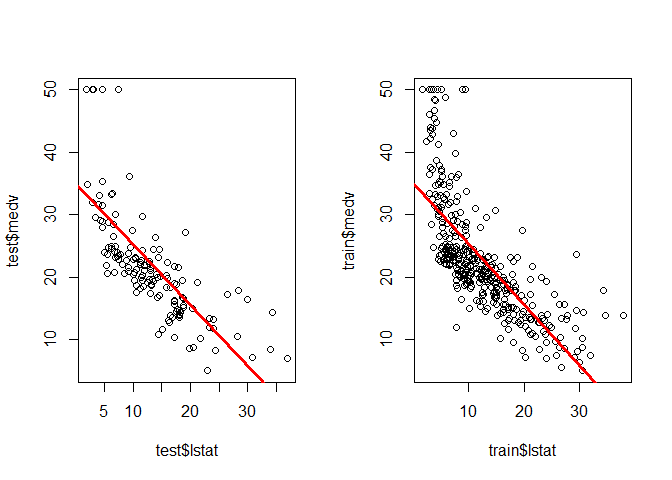

Simple Linear Regression
================
Nikhil Sawal
August 18, 2018

1. Loading Libraries
====================

``` r
#install.packages("ISLR")

library(MASS)
library(ISLR)
library(caTools)          #to do a test train split
```

2. Introduction
===============

We will use the Boston house price data which records medv (median house value) for 506 neighborhoods in Boston. The following lines of code will store the data in the object `df`. We use `attach(df)` to ease indexing operations for referring columns.

``` r
df <- Boston
attach(df)
```

To return the descriptions about each column of our data frame we use the `str()` function.

``` r
str(df)
```

    ## 'data.frame':    506 obs. of  14 variables:
    ##  $ crim   : num  0.00632 0.02731 0.02729 0.03237 0.06905 ...
    ##  $ zn     : num  18 0 0 0 0 0 12.5 12.5 12.5 12.5 ...
    ##  $ indus  : num  2.31 7.07 7.07 2.18 2.18 2.18 7.87 7.87 7.87 7.87 ...
    ##  $ chas   : int  0 0 0 0 0 0 0 0 0 0 ...
    ##  $ nox    : num  0.538 0.469 0.469 0.458 0.458 0.458 0.524 0.524 0.524 0.524 ...
    ##  $ rm     : num  6.58 6.42 7.18 7 7.15 ...
    ##  $ age    : num  65.2 78.9 61.1 45.8 54.2 58.7 66.6 96.1 100 85.9 ...
    ##  $ dis    : num  4.09 4.97 4.97 6.06 6.06 ...
    ##  $ rad    : int  1 2 2 3 3 3 5 5 5 5 ...
    ##  $ tax    : num  296 242 242 222 222 222 311 311 311 311 ...
    ##  $ ptratio: num  15.3 17.8 17.8 18.7 18.7 18.7 15.2 15.2 15.2 15.2 ...
    ##  $ black  : num  397 397 393 395 397 ...
    ##  $ lstat  : num  4.98 9.14 4.03 2.94 5.33 ...
    ##  $ medv   : num  24 21.6 34.7 33.4 36.2 28.7 22.9 27.1 16.5 18.9 ...

Our dataset has a total of 506 observations.

`colnames()` is used to check all the variables in the data set.

``` r
colnames(df)
```

    ##  [1] "crim"    "zn"      "indus"   "chas"    "nox"     "rm"      "age"    
    ##  [8] "dis"     "rad"     "tax"     "ptratio" "black"   "lstat"   "medv"

Now that, we explored the sturcture of the data set, lets do a test-train split. We will fit a regression model based on our training set and then use the model to see how it performs on the test set.

3. Test-Train split
===================

We will use the `sample.split()` function from the `'caTools'` package to make the test-train split. `set.seed()` is used to recreate the same test-train split every time. This is necessary to recreate similar results. Using `set.seed()` function, ensures that we get same instances in the training set and the test set when we use the sample.split() function.

``` r
set.seed(101)
sample <- sample.split(df$medv, SplitRatio = 0.7)
train <- subset(df, sample==T)
test <- subset(df, sample==F)
```

Let's check the number of observations in the test and training set using `str()` function.

``` r
str(train)
```

    ## 'data.frame':    367 obs. of  14 variables:
    ##  $ crim   : num  0.0273 0.0324 0.069 0.0299 0.0883 ...
    ##  $ zn     : num  0 0 0 0 12.5 12.5 12.5 0 0 0 ...
    ##  $ indus  : num  7.07 2.18 2.18 2.18 7.87 7.87 7.87 8.14 8.14 8.14 ...
    ##  $ chas   : int  0 0 0 0 0 0 0 0 0 0 ...
    ##  $ nox    : num  0.469 0.458 0.458 0.458 0.524 0.524 0.524 0.538 0.538 0.538 ...
    ##  $ rm     : num  7.18 7 7.15 6.43 6.01 ...
    ##  $ age    : num  61.1 45.8 54.2 58.7 66.6 85.9 39 61.8 84.5 56.5 ...
    ##  $ dis    : num  4.97 6.06 6.06 6.06 5.56 ...
    ##  $ rad    : int  2 3 3 3 5 5 5 4 4 4 ...
    ##  $ tax    : num  242 222 222 222 311 311 311 307 307 307 ...
    ##  $ ptratio: num  17.8 18.7 18.7 18.7 15.2 15.2 15.2 21 21 21 ...
    ##  $ black  : num  393 395 397 394 396 ...
    ##  $ lstat  : num  4.03 2.94 5.33 5.21 12.43 ...
    ##  $ medv   : num  34.7 33.4 36.2 28.7 22.9 18.9 21.7 20.4 18.2 19.9 ...

``` r
str(test)
```

    ## 'data.frame':    139 obs. of  14 variables:
    ##  $ crim   : num  0.00632 0.02731 0.14455 0.21124 0.22489 ...
    ##  $ zn     : num  18 0 12.5 12.5 12.5 12.5 0 0 0 0 ...
    ##  $ indus  : num  2.31 7.07 7.87 7.87 7.87 7.87 8.14 8.14 8.14 8.14 ...
    ##  $ chas   : int  0 0 0 0 0 0 0 0 0 0 ...
    ##  $ nox    : num  0.538 0.469 0.524 0.524 0.524 0.524 0.538 0.538 0.538 0.538 ...
    ##  $ rm     : num  6.58 6.42 6.17 5.63 6.38 ...
    ##  $ age    : num  65.2 78.9 96.1 100 94.3 82.9 36.6 69.5 91.7 85.7 ...
    ##  $ dis    : num  4.09 4.97 5.95 6.08 6.35 ...
    ##  $ rad    : int  1 2 5 5 5 5 4 4 4 4 ...
    ##  $ tax    : num  296 242 311 311 311 311 307 307 307 307 ...
    ##  $ ptratio: num  15.3 17.8 15.2 15.2 15.2 15.2 21 21 21 21 ...
    ##  $ black  : num  397 397 397 387 393 ...
    ##  $ lstat  : num  4.98 9.14 19.15 29.93 20.45 ...
    ##  $ medv   : num  24 21.6 27.1 16.5 15 18.9 20.2 18.2 15.2 13.9 ...

**Notice** that the train set has 367 observations and test set has 139 observations, since we used a split ratio = 0.7

4. Estimate Regression Coefficients
===================================

For the regression model that we want to fit, we use`medv` as the response. It represents the median house prices in Boston. Since we are dealing with simple linear regression, we will use only one predictor variable, `lstat`, where `lstat` represents the **percent of households with low socioeconomic status**.

In our situation response = medv (the median house value) and predictor = lstat. We also need to mention the name of the data set. We use the lm(response ~ predictor, data=data.name) function, to train our model.

``` r
lm.fit <- lm(medv ~ lstat, data = train)
```

Using the `summary()` function on `lm.fit` returns the estimates for regression coefficients, standard error, t-statistic, p-value and R^2 value.

``` r
summary(lm.fit)
```

    ## 
    ## Call:
    ## lm(formula = medv ~ lstat, data = train)
    ## 
    ## Residuals:
    ##     Min      1Q  Median      3Q     Max 
    ## -15.476  -4.237  -1.272   2.115  24.230 
    ## 
    ## Coefficients:
    ##             Estimate Std. Error t value Pr(>|t|)    
    ## (Intercept) 35.04677    0.66771   52.49   <2e-16 ***
    ## lstat       -0.97348    0.04661  -20.89   <2e-16 ***
    ## ---
    ## Signif. codes:  0 '***' 0.001 '**' 0.01 '*' 0.05 '.' 0.1 ' ' 1
    ## 
    ## Residual standard error: 6.407 on 365 degrees of freedom
    ## Multiple R-squared:  0.5445, Adjusted R-squared:  0.5432 
    ## F-statistic: 436.3 on 1 and 365 DF,  p-value: < 2.2e-16

From the above output, the pieces of information that we care about are, the coefficient estimates, Standara error, p-value and R^2 value. We will try to interpret each of these pieces of information from the context of our problem.

4.1 Interpreting the outcome of `summary()`
-------------------------------------------

### 4.1.1 Slope and y-intercept

Our regression equation is of the form, `mdev ~ y-intercept + b1 * lstat + e`. Based on the above output, the `y-intercept = 35.04` and the slope or `b1 = -0.97`.

-   The **y-intercept** suggests that, for neighborhoods in Boston, where the percent of households with low socioeconomic status is 0% or lstat = 0%, the median house value is 35.04 price unit.
-   The **negative slope** suggests that, as the value of lstat increses, i.e. as the percent of households with low socioeconomic status in a neighborhood increases, the median value of the houses declines.
-   It also suggests that, for every one percent increase in `lstat`, the median value of house drops by 0.97 in terms of price units.

### 4.1.2 Standard Error of estimate for lstat

The standard error for the estimate of lstat`(b1)` is 0.04661. It signifies, to what extent would our estimate change if we used a different data set. If the standard error is larger, the farther the estimate from 0, more likely are the chances that the corresponding predictor will be significant. If the estimate is nearer to 0, there is a greater chance of the confidence interval including 0, which renders the predictor insignificant. We will understand it, when we take a look at the confidence interval in the next section.

### 4.1.3 Confidence Interval and p-value

The 95% confidence interval is computed using the following line of code.

``` r
confint(lm.fit, level = 0.95)
```

    ##                 2.5 %     97.5 %
    ## (Intercept) 33.733729 36.3598096
    ## lstat       -1.065135 -0.8818298

Since we have a 2-tailed test, our critical regions include 2.5% (0.05/2) in the bottom tail and 2.5% (1-0.05/2) in the top tail. Our confidence interval for `lstat` does not include 0 and the `p-value` is also very small `(<2e-16)`. So, we reject the null hypothesis, claiming that there is a relationship between the response and predictors i.e. the slope != 0. The smaller `p-value` suggests that, its extremely unlikely, that the results were observed by chance.

### 4.1.4 Assessing the accuracy of the model

Lastly, the summary outputs the R^2 value based on the training set. It's 0.5445. It suggests that 54.45% of the total variability in Y (response) is explained by the variability in X (predictor).

We can also get a list of all the outputs that `summary()` function returns, by using `names()` function on `lm.fit`.

``` r
names(lm.fit)
```

    ##  [1] "coefficients"  "residuals"     "effects"       "rank"         
    ##  [5] "fitted.values" "assign"        "qr"            "df.residual"  
    ##  [9] "xlevels"       "call"          "terms"         "model"

Now that we have trained a model. It's time to make some prediction.

5. Predicting `medv`
====================

The `predict()` function is used to predict response based on the model that we trained from the training set. Later we compare these predictions with the observed values that we have in our test set and assess the accuracy of our model using Mean Squared Error (MSE) and Coefficient of Determination (R^2). We bind the predicted value and the observed values and store them in a data frame named `results`.

``` r
prediction <- predict(lm.fit, test)
results <- cbind(prediction, test$medv)
colnames(results) <- c('predicted', 'actual')
results <- as.data.frame(results)
head(results)
```

    ##    predicted actual
    ## 1  30.198828   24.0
    ## 2  26.149142   21.6
    ## 8  16.404586   27.1
    ## 9   5.910448   16.5
    ## 11 15.139059   15.0
    ## 12 22.128661   18.9

Now that we have our predictions ready, let's check if our model predicted a negative value for median house value. If that's the case, we would want to replace these values with 0, since it is not possible to evaluate the value of a house to be negative. We use `min()` function on the predicted column from `results` data frame, to check this.

``` r
min(results$predicted)
```

    ## [1] -0.9526016

Since we do observe a negative value, it's necessary that we replace it with, 0. To take care of negative values, we write a function, `make_zero` that replaces every negative value with a 0.

``` r
make_zero <- function(x){
  if(x<0){
    return(0)
  }else{
    return(x)
  }
}
```

Now, we apply the function to the predicted columns of results data frame, to replace all negative values with a 0.

``` r
results$predicted <- sapply(results$predicted, make_zero)
min(results$predicted)
```

    ## [1] 0

6. Asses Model Accuracy
=======================

Once we have all of our predictions ready, it's time to check the accuracy of our fit. We will use 2 measures to do this:

-   Mean squared error (MSE)
-   Coefficient of determination (R^2)

6.1 Mean squared error \[MSE\]
------------------------------

MSE measures the average squared difference between between the observed value and the predicted values.

``` r
mse <- mean((results$predicted-results$actual)^2)
mse
```

    ## [1] 32.44591

The way we interpret this outcome is that, even if the model were correct and the true values of the unknown coefficients (b0 and b1) were known exactly, any prediction of `medv` the response, based on `lstat` the predictor would be off by 32.44591

6.2 Coefficient of determination \[R^2\]
----------------------------------------

R^2 measures the amount of variation in Y, that is explained be the variation in X.

``` r
SSRes <- sum((results$predicted-results$actual)^2)
SST <- sum((test$medv-mean(df$medv))^2)

R2 <- 1-(SSRes/SST)
R2
```

    ## [1] 0.5377003

**Notice** the R^2 value we got from our test set is very close to the one we obtained from our training set.

`predict()` function can be use to produce confidence and prediction interval for response (medv) for a given value of predictor (lstat)

``` r
head(predict(lm.fit, test, interval = "confidence"))
```

    ##          fit       lwr       upr
    ## 1  30.198828 29.252803 31.144853
    ## 2  26.149142 25.426809 26.871475
    ## 8  16.404586 15.501673 17.307498
    ## 9   5.910448  4.174382  7.646514
    ## 11 15.139059 14.150689 16.127428
    ## 12 22.128661 21.466195 22.791127

``` r
head(predict(lm.fit, test, interval = "prediction"))
```

    ##          fit       lwr      upr
    ## 1  30.198828 17.564640 42.83302
    ## 2  26.149142 13.529732 38.76855
    ## 8  16.404586  3.773553 29.03562
    ## 9   5.910448 -6.807322 18.62822
    ## 11 15.139059  2.501630 27.77649
    ## 12 22.128661  9.512536 34.74479

7. Visualization
================

We now fit a regression line to both our test and train data and see how it performs on both datasets side-by-side.

``` r
par(mfrow=c(1,2))
plot(test$lstat, test$medv)
abline(lm.fit, lwd=3, col="red")

plot(train$lstat, train$medv)
abline(lm.fit, lwd=3, col="red")
```



The relation between Y and X does look non-linear, but our regression line is doing a decent job.
